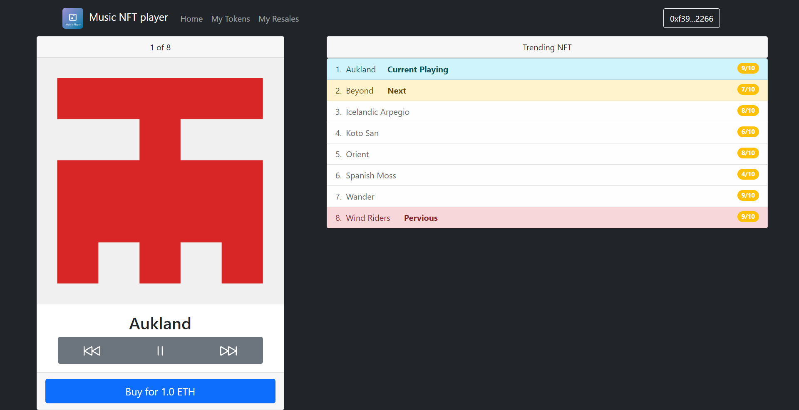

# Web-3-Music-Player-on-Blockchain

This project is a web 3.0 music player that utilizes blockchain technology for decentralized music storage and streaming. It allows users to upload, store, and play music files securely and transparently.

## Snapshots




## Research Paper Publication

- The research paper titled "Web-3.0 Music Player on Blockchain" has been published in the prestigious IEEE conference.
- The paper can be accessed and downloaded from [here](https://www.researchgate.net/publication/370178652_Web-3_Music_Player_on_Blockchain).

## Conference Presentation

- The project was also presented at a renowned conference where it received recognition for its innovative approach and contribution to the field.
- The presentation showcased the key features and technical aspects of the Web-3.0 Music Player on Blockchain.

## Technology Stack & Tools

- Solidity (Writing Smart Contract)
- Javascript (React & Testing)
- [Ethers](https://docs.ethers.io/v5/) (Blockchain Interaction)
- [Hardhat](https://hardhat.org/) (Development Framework)
- [Ipfs](https://ipfs.io/) (Metadata storage)
- [React routers](https://v5.reactrouter.com/) (Navigational components)

## Requirements For Initial Setup
- Install [NodeJS](https://nodejs.org/en/), should work with any node version below 16.5.0
- Install [Hardhat](https://hardhat.org/)

## Setting Up
### 1. Clone/Download the Repository

### 2. Install Dependencies:
```
$ cd music_nfts
$ npm install
```
### 3. Boot up local development blockchain
```
$ cd music_nfts
$ npx hardhat node
```

### 4. Connect development blockchain accounts to Metamask
- Copy private key of the addresses and import to Metamask
- Connect your metamask to hardhat blockchain, network 127.0.0.1:8545.
- If you have not added hardhat to the list of networks on your metamask, open up a browser, click the fox icon, then click the top center dropdown button that lists all the available networks then click add networks. A form should pop up. For the "Network Name" field enter "Hardhat". For the "New RPC URL" field enter "http://127.0.0.1:8545". For the chain ID enter "31337". Then click save.  


### 5. Run deploy script to migrate smart contracts
`npm run deploy`

### 6. Run Tests
`$ npx hardhat test`

### 7. Launch Frontend
`$ npm run start`


License
----
MIT
